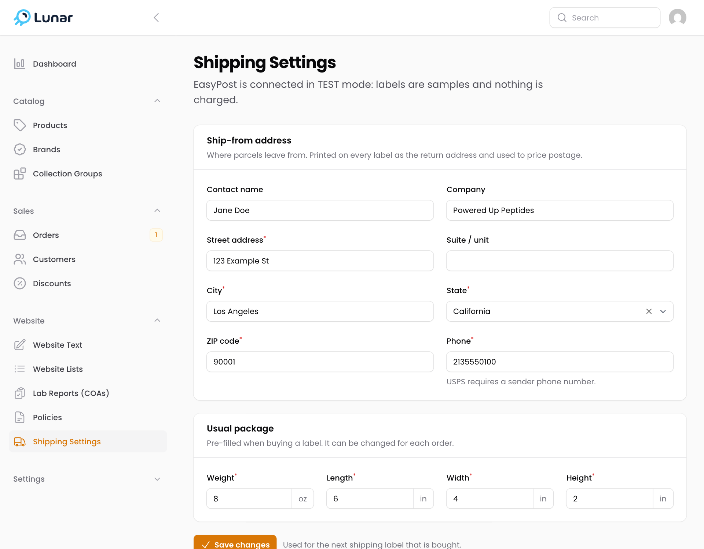
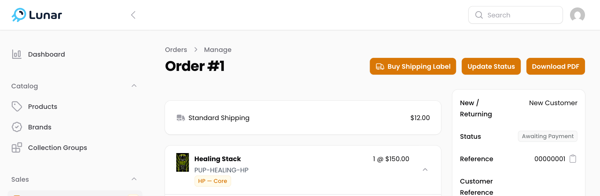
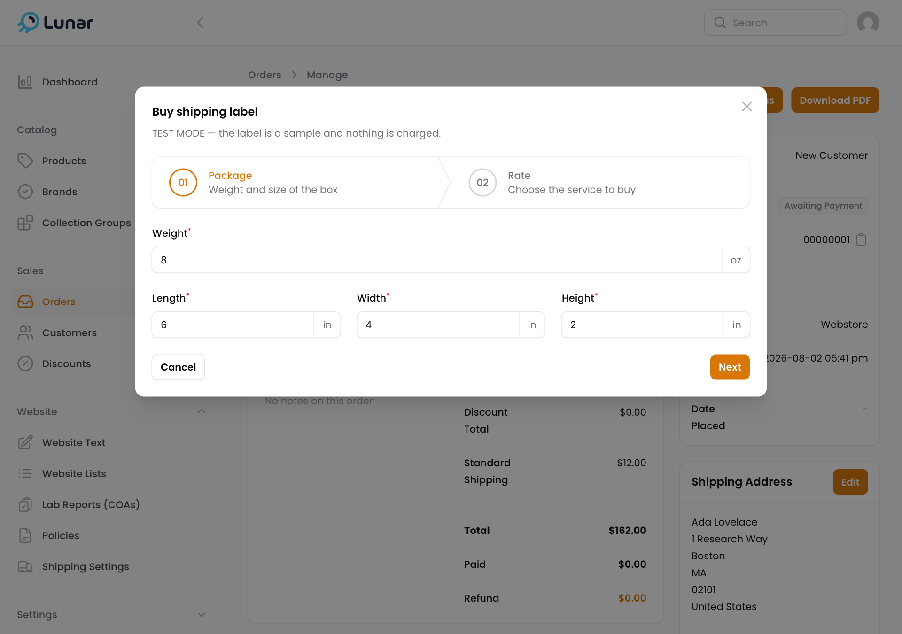
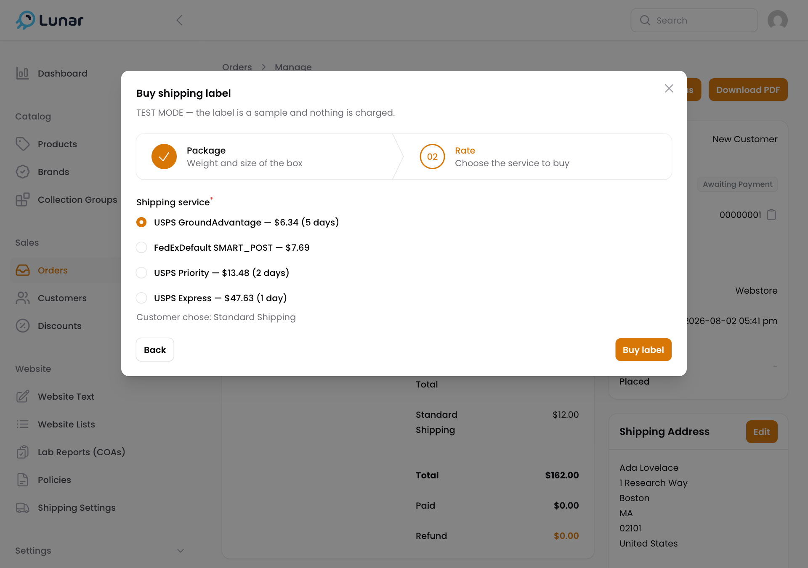
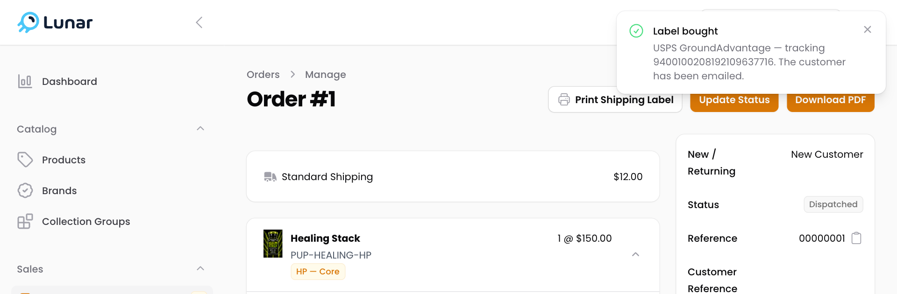
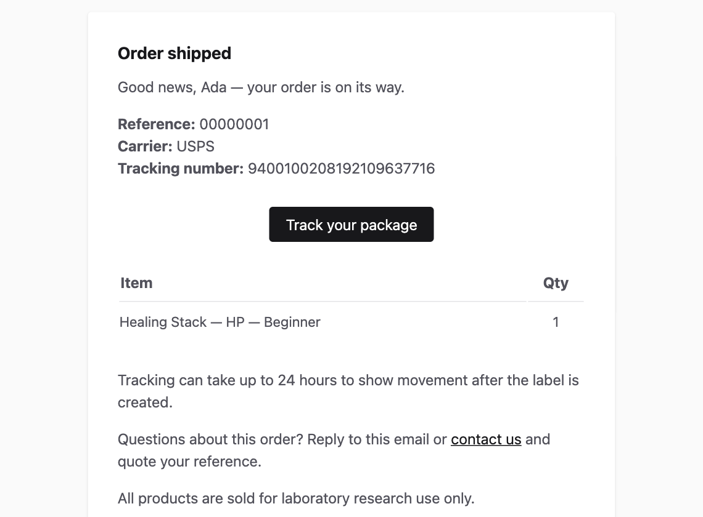

# Shipping guide

How to set up shipping once, and how to ship an order. Everything happens in the store admin: <https://powereduppeptides.com/lunar>

Shipping labels are bought through EasyPost. You choose the carrier and price for each order, print the label, and the customer is emailed their tracking number automatically.

## One-time setup

### 1. Add a payment method in EasyPost

Log in at [easypost.com](https://www.easypost.com), go to **Account Settings → Billing**, and add a card or funds. Labels cannot be bought without it.

### 2. Enter your ship-from address

In the admin menu, open **Website → Shipping Settings**.

- **Ship-from address** — where your parcels leave from. It is printed on every label as the return address. Use a first and last name, and include a phone number.
- **Usual package** — the weight and size of your typical box. You can change it for each order.

Click **Save changes**.

The line under the title tells you the mode. **LIVE** means labels are real and charged. **TEST** means labels are free samples that cannot be used.

## Shipping an order

### 1. Open the order

Go to **Sales → Orders**, open the order, and click **Buy Shipping Label**.

### 2. Check the package

Confirm the weight and size of the box, then click **Next**. Nothing is charged yet.

### 3. Choose a service and buy

You will see each available service with its price and delivery time. The cheapest is selected for you. The line below the list shows which shipping method the customer paid for.

Pick one and click **Buy label**. This is the step that charges your EasyPost account.

### 4. Print the label

The order is now marked **Dispatched** and the customer has been emailed their tracking number. Click **Print Shipping Label**, print it, and stick it on the box.

## Tracking an order

**What the customer sees.** As soon as you buy the label, the customer gets an "Order shipped" email with the carrier, the tracking number, and a **Track your package** button. Customers with an account also see the same tracking on their order page on the website.

**Where you can check it.**

- **In the admin** — open the order and scroll to **Additional Information** on the right. It lists the carrier, the tracking number, and the tracking link for that order.
- **In EasyPost** — open **Trackers** in the EasyPost menu to see the delivery status of every parcel in one place. You can search by tracking number or by the order number.

Tracking can take up to 24 hours to show movement after a label is bought. The order stays **Dispatched** in the admin; it does not change by itself when the parcel is delivered.

## Good to know

- **One label per order.** Once a label is bought, the buy button is replaced by the print button. You can reprint as often as you like.
- **Wrong label?** Cancel it in EasyPost (**Shipments → the shipment → Refund**) to get the postage back.
- **Red error instead of prices?** It usually means the customer's address is not a valid US address. Fix it with **Edit** on the order's shipping address and try again.
- **US only.** The store only accepts US shipping addresses at checkout.
